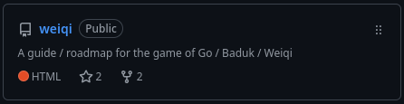
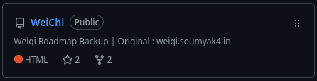

<h1>Hi 👋, I'm Soumya   A Passionate Student/Teacher from Kolkata,India</h1>
<h3>Teaching Martial Arts for Body & Brain</h3>

| WHAT | WHERE |
|---|---|
| 🖥️ Present Work 1  | Teacher & Admin at [AIGP](https://aigp.org.in/) |
| 🥋 Present Work 2 | Teaching Martial Arts for Body & Brain  at [BB Dojo](https://github.com/BB-Dojo) |
| ⚫⚪ Learn Baduk - Weiqi - Go Game | [Go Roadmap](https://weiqi.soumyak4.in/) |
| 🧑🏻‍💻 My Personal Website    | [SoumyaK4](https://soumyak4.in/) |
| ✍🏽 Writing | [The Fallen Poet](https://www.miraquill.com/user.html?username=the_fallen_poet) |
| 🎓 Academics | [Education](/Education.md) |
| ✨ Other | [Experiences](https://soumyak4.in/Experiences) |
| 🌐 I also love creating front-end websites  For no particular reason at all | Currently exploring [Jekyll](https://jekyllrb.com/) |
| 💬 For Queries | [Contact Me](https://t.me/soumyak4) |

<h1>Organization Projects</h1>

| Weiqi Roadmap | weiqi.bak |
|------|------|
|   |   |

<h3>↓ Socials ↓</h3>

|  |  |  |
|-----|------|------|
||||

<!--
<h3>Music</h3>

  

    <iframe style="position:absolute;top:0;left:0;" width="100%" height="100%" src="https://odesli.co/embed/?url=https%3A%2F%2Fsong.link%2Ftfp-trapped&theme=dark" frameborder="0" allowfullscreen sandbox="allow-same-origin allow-scripts allow-presentation allow-popups allow-popups-to-escape-sandbox" allow="clipboard-read; clipboard-write"></iframe>
  

-->

